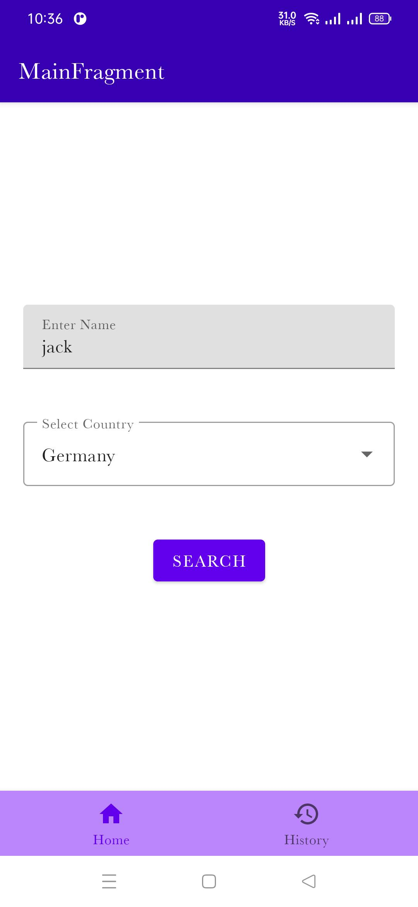
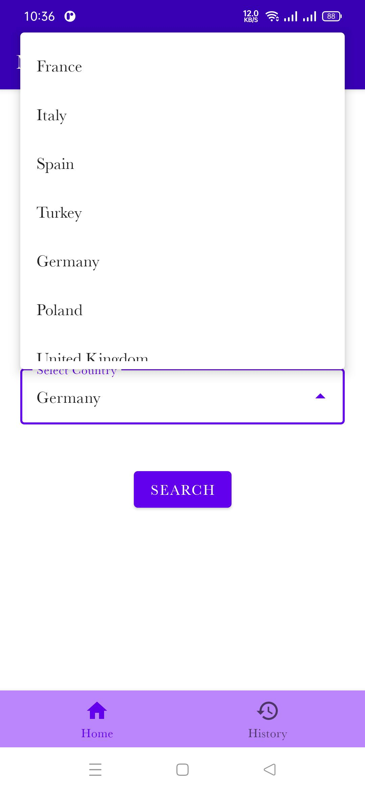
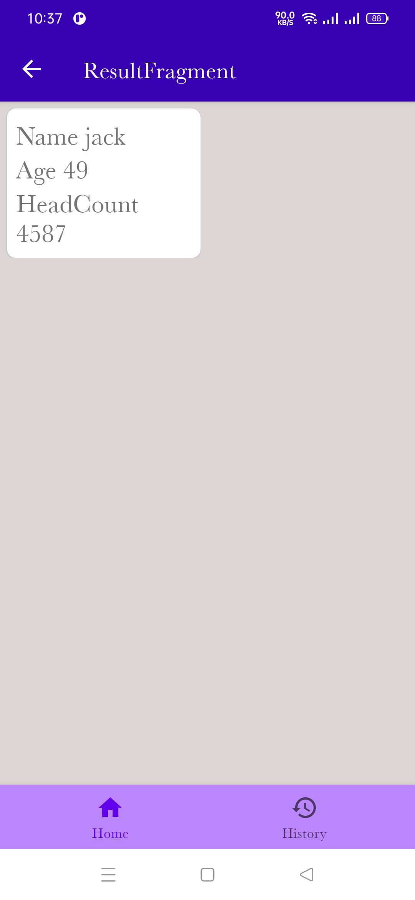
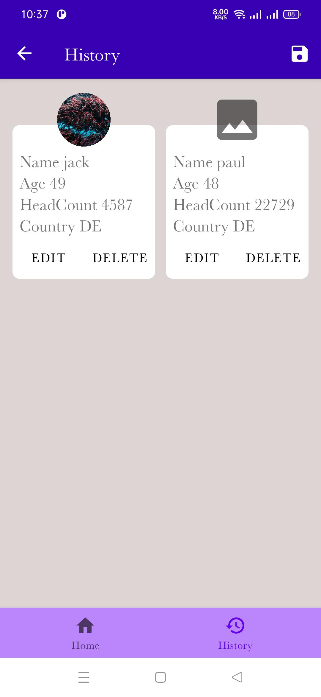
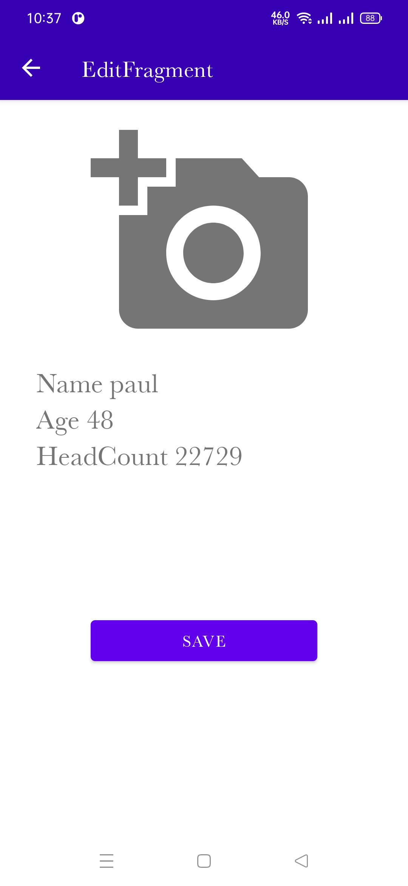
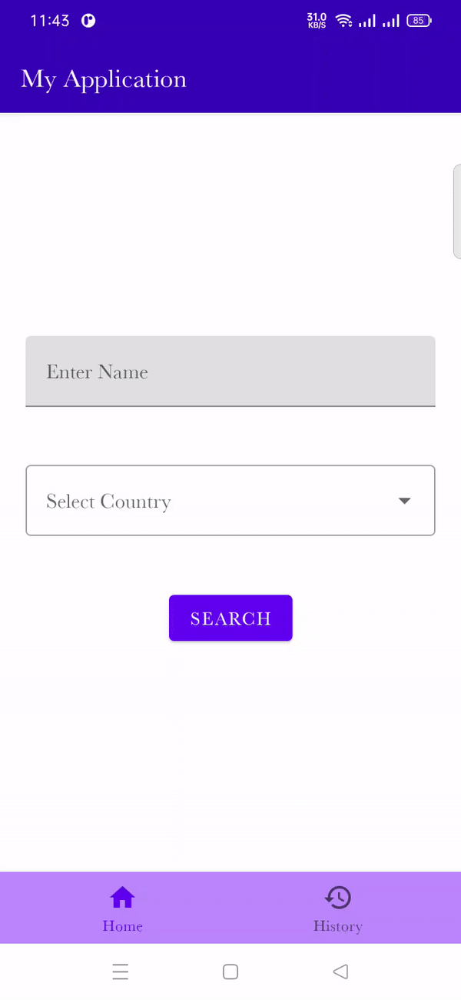

# Android MVVM with [Single Activity](https://developer.android.com/guide/navigation/navigation-migrate) sample app that uses kotlin coroutines flow.
This is a sample app  that uses kotlin coroutines [flow](https://developer.android.com/kotlin/flow) , [stateflow](https://developer.android.com/kotlin/flow/stateflow-and-sharedflow).

This app uses [agify](https://api.agify.io/) REST service to get the age by name and county.  

It is MVVM with one activity Architecture using best practices of [navigation component](https://developer.android.com/guide/navigation)

## Libraries Used
* [kotlin](https://kotlinlang.org/)
  * [kotlin coroutines](https://github.com/Kotlin/kotlinx.coroutines)
* [androidx](https://developer.android.com/jetpack/androidx)
  * [appcompat](https://developer.android.com/jetpack/androidx/releases/appcompat)
  * [android ktx](https://developer.android.com/kotlin/ktx)
  * [constraintlayout](https://developer.android.com/reference/android/support/constraint/ConstraintLayout)
  * [lifecycle](https://developer.android.com/jetpack/androidx/releases/lifecycle)
* [material-components](https://github.com/material-components/material-components-android)
* [koin](https://github.com/InsertKoinIO/koin)
* [retrofit](https://github.com/square/retrofit)
* [okhttp](https://github.com/square/okhttp)
* [Gson](https://github.com/google/gson)
* [Itext](https://github.com/itext/itextpdf)
* [Picasso](https://github.com/square/picasso)
* [Apache Common](https://commons.apache.org/proper/commons-lang/dependency-info.html)
* [navigation](https://developer.android.com/guide/navigation)
* [room](https://developer.android.com/training/data-storage/room)

## Screenshot

Main Screenshot|Main Select Lang|Searched Data Result
:--:|:--:|:--:|
||
Searched History|Edit Img Change|Whole Img Gif
||

## Where To go From here
*    Marvel Api [Android Components Architecture](https://github.com/vmadalin/android-modular-architecture) in a Modular Word is a sample project that presents modern, 2020 approach to [Android](https://www.android.com/) application development         using [Kotlin](https://kotlinlang.org/) and latest tech-stack.
*   A UI/Material Design sample. The interface of the app is deliberately kept simple to focus on architecture. Check out [Plaid](https://github.com/android/plaid) instead.
*   A complete Jetpack sample covering all libraries. Check out [Android Sunflower](https://github.com/googlesamples/android-sunflower) or the advanced [Github Browser Sample](https://github.com/googlesamples/android-architecture-components/tree/master/GithubBrowserSample) instead.
*   A real production app with network access, user authentication, etc. Check out the [Google I/O app](https://github.com/google/iosched), [Santa Tracker](https://github.com/google/santa-tracker-android) or [Tivi](https://github.com/chrisbanes/tivi) for that.
*   Model-View-ViewModel (ie MVVM) is a template of a client application architecture  [MVVM](https://github.com/ahmedeltaher/MVVM-Kotlin-Android-Architecture)
*   [MarvelHeroes](https://github.com/skydoves/MarvelHeroes) is a demo application based on modern Android application tech-stacks and MVVM architecture.Fetching data from the network and integrating persisted data in the database via repository pattern. 
 # UseCase
You can reference the good use cases of this library in the below repositories.
- [Pokedex](https://github.com/skydoves/pokedex) - 🗡️ Android Pokedex using Hilt, Motion, Coroutines, Flow, Jetpack (Room, ViewModel, LiveData) based on MVVM architecture.
- [DisneyMotions](https://github.com/skydoves/DisneyMotions) - 🦁 A Disney app using transformation motions based on MVVM (ViewModel, Coroutines, LiveData, Room, Repository, Koin) architecture.
- [MarvelHeroes](https://github.com/skydoves/marvelheroes) - ❤️ A sample Marvel heroes application based on MVVM (ViewModel, Coroutines, LiveData, Room, Repository, Koin)  architecture.
- [TheMovies2](https://github.com/skydoves/TheMovies2) - 🎬 A demo project using The Movie DB based on Kotlin MVVM architecture and material design & animations.
- [ForUiRef](https://github.com/wasabeef/awesome-android-ui) -A curated list of awesome Android UI/UX libraries.

